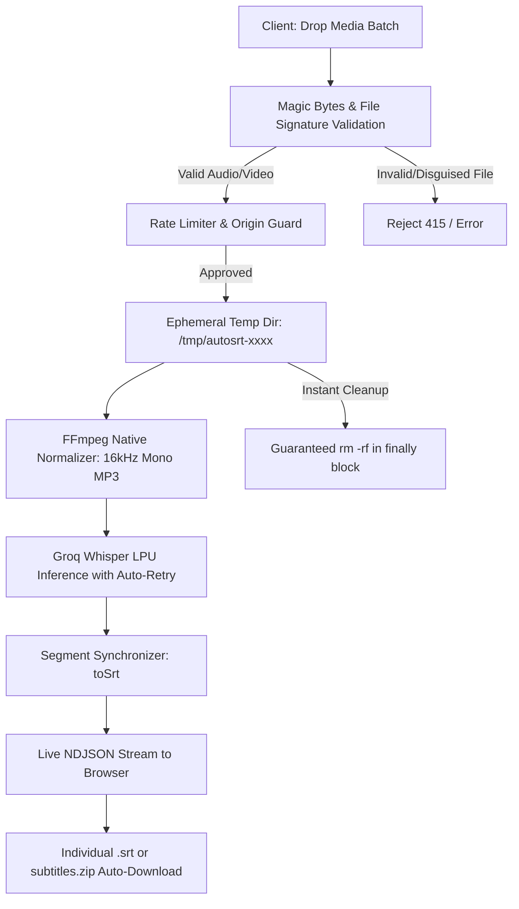

<div align="center">

# 🎬 AutoSRT

### High-Performance Batch Video & Audio to Subtitles (`.srt`) Powered by Groq Whisper & FFmpeg

[](https://autosrt.anas.lol)
[](https://nextjs.org/)
[](https://www.typescriptlang.org/)
[](https://groq.com/)
[](https://www.docker.com/)
[](https://coolify.io)
[](https://owasp.org)
[](https://opensource.org/licenses/MIT)

<p align="center">
  <b>Transform hours of multimedia into perfectly synchronized subtitles in seconds.</b><br/>
  Zero setup headaches, zero data retention, fully dockerized, and enterprise-hardened.
</p>

[🌐 **Live Demo**](https://autosrt.anas.lol) • [🪟 **Download .EXE**](https://github.com/anassaadhamad/AutoSRT/raw/main/AutoSRT.exe) • [Quick Start](#-quick-start) • [Coolify Deployment](#-coolify--docker-deployment) • [Architecture](#-architecture--workflow) • [Security](#-enterprise-grade-security)

</div>

---

## ✨ Key Features

- **🚀 Lightning-Fast AI Transcription**: Leverages **Groq Whisper Large v3 Turbo** on specialized LPUs to transcribe speech up to 216x faster than real-time.
- **🎧 Full Audio & Video Mixed Batching**: Drop videos (`.mp4`, `.mov`, `.mkv`, `.avi`, `.webm`, etc.) and audio recordings (`.mp3`, `.wav`, `.m4a`, `.aac`, `.flac`, etc.) into the exact same batch.
- **🪟 Native Windows Desktop App**: Run `AutoSRT.exe` directly on Windows with zero setup, zero dependencies, and instant frameless desktop interface.
- **🔑 Bring Your Own Key (BYOK)**: Use the shared server instance, or easily enter your own free Groq API key in the app settings for unlimited personal quota.
- **⚡ Smart Queue & State Preservation**:
  - **Zero Duplicate Processing**: Already completed files (`ready`) are preserved and never re-uploaded or re-billed when you add new files.
  - **Individual & Batch Downloads**: Download any single `.srt` directly with 1 click, or download the full batch as a tidy `subtitles.zip`.
  - **One-Click Retry**: Retry any individual transient failure without re-processing the rest of your batch.
- **🛑 Real-Time Per-File Cancellation**: Click the **X** button on any in-progress upload to instantly abort the network stream, terminate the background FFmpeg process, and reclaim system memory via native `AbortController`.
- **🔒 Zero-Data Retention (Stateless)**: All audio and video files are processed in isolated ephemeral storage and purged immediately with guaranteed `finally` cleanup.
- **🛡️ Enterprise Security Fortress**: Built-in OWASP security headers, sliding-window Rate Limiting, Magic Bytes deep container inspection, anti-CSRF guards, and an anti-SSRF FFmpeg sandbox.
- **🐳 1-Click Coolify & Docker Deployment**: Minimal standalone production build (`< 150MB`) with native Debian FFmpeg and non-root security.

---

## 🏗️ Architecture & Workflow



---

## 🎛️ Supported Formats

| Category | Formats Supported |
|---|---|
| **Video** | `.mp4`, `.mov`, `.mkv`, `.avi`, `.webm`, `.m4v`, `.mpeg`, `.mpg`, `.wmv`, `.flv`, `.3gp` |
| **Audio** | `.mp3`, `.wav`, `.m4a`, `.aac`, `.ogg`, `.flac`, `.wma`, `.opus`, `.weba` |
| **Output** | SubRip Subtitles (`.srt`) with standardized `HH:MM:SS,mmm` millisecond timestamps |

---

## 🚀 Quick Start

### 1. Prerequisites
- **Node.js**: v20 or v22+
- **Groq API Key**: Obtain a free/production key from [Groq Console](https://console.groq.com/keys).

### 2. Local Setup
```bash
# Clone the repository
git clone https://github.com/anassaadhamad/AutoSRT.git
cd AutoSRT

# Install dependencies
npm install

# Configure environment
cp .env.example .env.local
```

Open `.env.local` and paste your key:
```env
GROQ_API_KEY=gsk_your_groq_api_key_here
```

### 3. Run Development Server
```bash
npm run dev
```
Open [http://localhost:3000](http://localhost:3000) in your browser.

---

## 🪟 Windows Desktop App (`AutoSRT.exe` - 100% Local Edition)

AutoSRT includes a **100% standalone, zero-dependency Windows desktop client** that runs completely on your local machine with no reliance on external servers:

[-6366F1?style=for-the-badge&logo=windows&logoColor=white)](https://github.com/anassaadhamad/AutoSRT/raw/main/AutoSRT.exe)

### Highlights of the Desktop Edition:
- **🔒 100% Local & Private**: Direct communication between your PC and Groq's official API (`https://api.groq.com`). Zero intermediate servers, zero logs.
- **🔑 Bring Your Own Key**: Enter your free Groq API key once. It is saved locally in `%APPDATA%\AutoSRT\settings.ini`.
- **📂 Drag & Drop Files & Folders**: Drop multiple video/audio files or entire folders into the queue with a single mouse drag.
- **⚡ Local FFmpeg Engine**: Automatically detects FFmpeg in your PATH or app folder. If missing, it features a **1-click automatic download** of portable FFmpeg directly into `%LOCALAPPDATA%\AutoSRT\bin`.
- **🎬 Smart Speech Audio Extraction**: Converts video files into ultra-compact, crystal-clear 16kHz mono audio streams before sending to Groq, turning multi-gigabyte videos into ~15MB in seconds.
- **💾 Automatic `.srt` Placement**: Subtitles are saved directly next to your video files (e.g. `Lecture.mp4` ➡️ `Lecture.srt`) or in any custom folder you designate.
- **🌐 Multi-Language (English Default & Arabic)**: Clean bilingual interface with English as the primary default and an instant 1-click toggle to Arabic (`العربية`) with native RTL layout switching.
- **👁️ Built-in Subtitle Viewer**: One-click to preview the generated subtitles or reveal the file in Windows Explorer.
- **🪶 Ultra-Lightweight (64 KB)**: No heavy Electron, no Python runtime. Runs natively on any Windows 10 or 11 system out of the box!

---

## 🐳 Coolify & Docker Deployment

AutoSRT is pre-configured with a production-optimized multi-stage `Dockerfile` and `docker-compose.yml`.

### Option A: Deploy on Coolify (Recommended)

1. Open your **Coolify** dashboard and navigate to your project.
2. Click **+ New Resource** ➡️ **Public Repository** (or Private if authenticated).
3. Repository URL:
   ```
   https://github.com/anassaadhamad/AutoSRT
   ```
   Branch: `main`.
4. Coolify will auto-detect the `Dockerfile`:
   - **Internal Port**: `3000`
   - **Health Check Path**: `/api/health`
5. In **Environment Variables**, set:
   ```env
   GROQ_API_KEY=gsk_your_groq_api_key_here
   ```
6. Click **Deploy**. Your app will be live with zero downtime!

> For detailed deployment walkthroughs, see [COOLIFY_GUIDE.md](./COOLIFY_GUIDE.md).

### Option B: Local Docker Run
```bash
docker compose up --build -d
```

---

## 🛡️ Enterprise-Grade Security

AutoSRT includes an industry-grade defense-in-depth security model:

```
┌────────────────────────────────────────────────────────┐
│                   BROWSER / CLIENT                     │
└──────────────────────────┬─────────────────────────────┘
                           │
       [1] OWASP Security Headers (CSP, HSTS, X-Frame)
       [2] Anti-CSRF & Cross-Site Origin Verification
       [3] IP Sliding-Window Rate Limiter (Anti-DoS)
                           │
┌──────────────────────────▼─────────────────────────────┐
│                 AUTOSRT APPLICATION                    │
│                                                        │
│  [4] Deep Magic Bytes Verification (Blocks fake files) │
│  [5] Path Traversal & Control Character Sanitization   │
│  [6] Sandboxed FFmpeg Execution (-protocol_whitelist)  │
│  [7] Native AbortController Signal Propagation         │
│  [8] Non-Root Docker User (UID 1001)                   │
└────────────────────────────────────────────────────────┘
```

1. **OWASP HTTP Security Headers**: Strict `Content-Security-Policy`, `X-Frame-Options: DENY`, `X-Content-Type-Options: nosniff`, and `Strict-Transport-Security` (HSTS).
2. **Anti-CSRF & Cross-Site Leeching Guard**: Checks `Sec-Fetch-Site` and `Origin` headers to prevent third-party websites from consuming your server resources or Groq quota.
3. **Sliding-Window Rate Limiting**: Protects endpoints against brute-force attacks and abuse.
4. **Magic Bytes Media Verification**: Inspects actual binary container signatures (`ftyp`, `RIFF`, `ID3`, `OggS`, `Matroska`, etc.) to reject disguised scripts or executables before invoking FFmpeg.
5. **FFmpeg Anti-SSRF Sandbox**: Hardened with `-protocol_whitelist "file,crypto,data"` and `-nostdin` to eliminate Server-Side Request Forgery (SSRF) and cloud metadata leaks (`169.254.169.254`).
6. **Path Traversal Shield**: Rigorously sanitizes filenames against directory traversal sequences (`../`, null bytes, and shell metacharacters).

---

## ⚙️ Configuration

All configuration is driven through environment variables:

| Variable | Type | Default | Description |
|---|---|---|---|
| `GROQ_API_KEY` | **Required** | - | Groq Cloud API Key for Whisper transcription |
| `GROQ_WHISPER_MODEL` | Optional | `whisper-large-v3-turbo` | Whisper model (`whisper-large-v3-turbo` or `whisper-large-v3`) |
| `TRANSCRIPTION_CONCURRENCY` | Optional | `2` | Number of simultaneous media transcriptions per batch (1 - 5) |
| `MAX_BATCH_FILES` | Optional | `10` | Maximum number of files permitted in a single batch (1 - 50) |
| `MAX_FILE_SIZE_MB` | Optional | `500` | Maximum upload size per individual file in megabytes |
| `RATE_LIMIT_PER_MINUTE` | Optional | `30` | Maximum requests permitted per client IP address per minute |
| `FFMPEG_PATH` | Optional | auto / `/usr/bin/ffmpeg` | Custom path to system FFmpeg binary |

---

## 🩺 Healthcheck & Monitoring

AutoSRT provides a dedicated health check endpoint for uptime monitors and Coolify rolling deployments:

```bash
curl http://localhost:3000/api/health
```

**Response:**
```json
{
  "status": "ok",
  "app": "AutoSRT",
  "timestamp": "2026-09-23T06:00:00.000Z",
  "ffmpeg": true,
  "groqConfigured": true
}
```

---

## 🤝 Contributing

Contributions, issues, and feature requests are welcome! Feel free to check the [issues page](https://github.com/anassaadhamad/AutoSRT/issues).

1. Fork the Project
2. Create your Feature Branch (`git checkout -b feature/AmazingFeature`)
3. Commit your Changes (`git commit -m 'feat: Add AmazingFeature'`)
4. Push to the Branch (`git push origin feature/AmazingFeature`)
5. Open a Pull Request

---

## 📄 License

Distributed under the **MIT License**. See `LICENSE` for more information.

<div align="center">
  <sub>Built with ❤️ by <a href="https://github.com/anassaadhamad">Anas Saad Hamad</a></sub>
</div>
