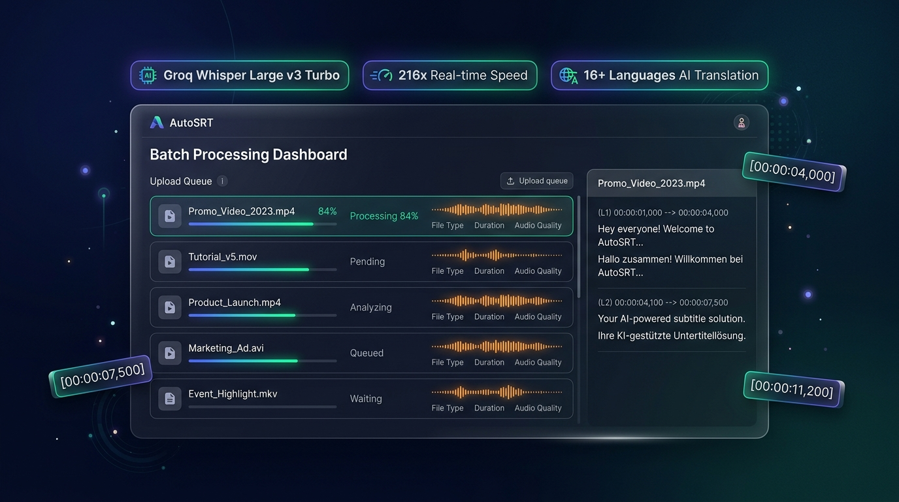
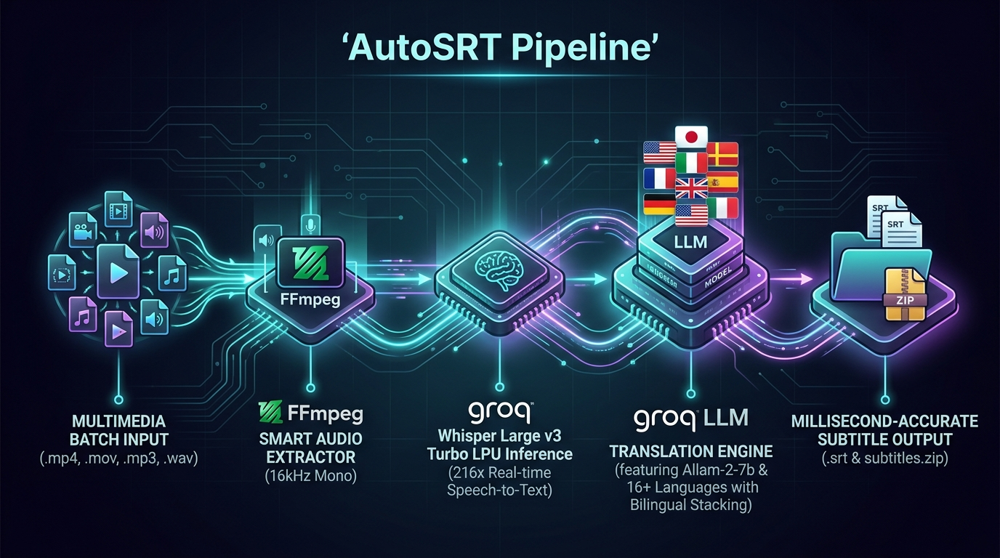
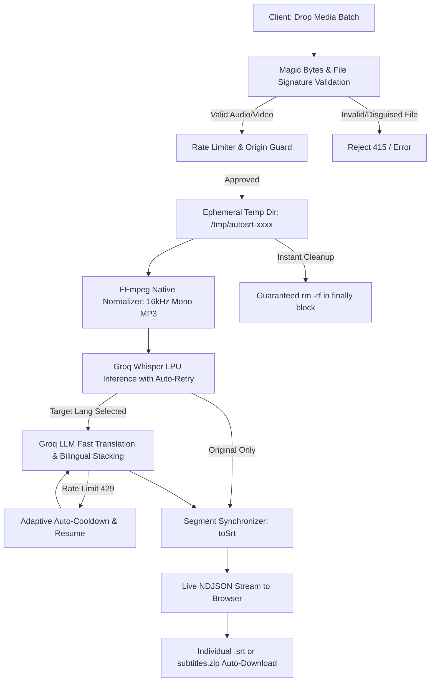
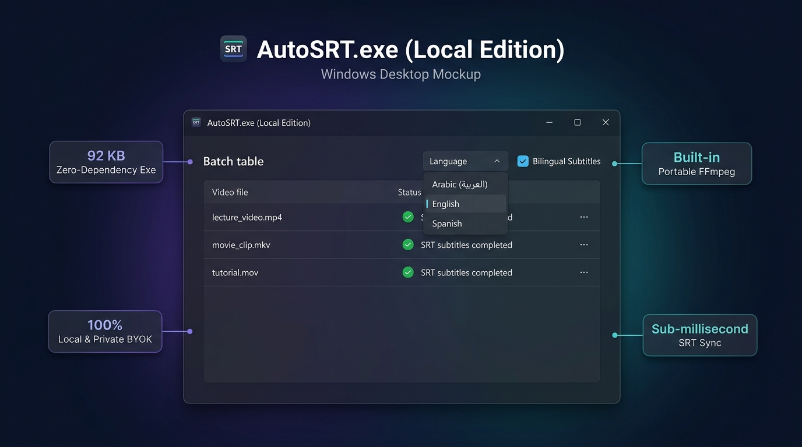

<div align="center">


# 🎬 AutoSRT

### High-Performance Batch Video & Audio to Subtitles (`.srt`) Powered by Groq Whisper, LLM Translation & FFmpeg

[](https://autosrt.anas.lol)
[-6366F1?style=for-the-badge&logo=windows&logoColor=white)](https://github.com/anassaadhamad/AutoSRT/raw/main/AutoSRT.exe)
[](https://nextjs.org/)
[](https://www.typescriptlang.org/)
[](https://groq.com/)
[](https://www.docker.com/)
[](https://coolify.io)
[](https://opensource.org/licenses/MIT)

<p align="center">
  <b>Transform hours of multimedia into perfectly synchronized and translated subtitles in seconds.</b><br/>
  Zero setup headaches, zero data retention, AI translation to 16+ languages, bilingual mode, fully dockerized, and enterprise-hardened.
</p>

[🌐 **Live Demo**](https://autosrt.anas.lol) • [🪟 **Download .EXE**](https://github.com/anassaadhamad/AutoSRT/raw/main/AutoSRT.exe) • [Web Features](#-interactive-web-app-features) • [Desktop App](#-windows-desktop-app-autosrtexe---100-local-edition) • [API Docs](#-api-reference) • [Architecture](#-architecture--workflow) • [بالعربية](#-دليل-المشروع-بالكامل-بالعربية)

<br/>



</div>

---

## ✨ Key Features & Capabilities

- **🚀 Lightning-Fast AI Transcription**: Leverages **Groq Whisper Large v3 Turbo** on specialized LPUs to transcribe speech up to 216x faster than real-time.
- **🌍 AI Multi-Language Subtitle Translation**: Automatically translate extracted subtitles into **16+ major world languages** (Arabic, English, Spanish, French, German, Turkish, Italian, Russian, Chinese, Japanese, Korean, Portuguese, Indonesian, Hindi, Urdu, etc.) powered by Groq's high-throughput LLMs.
- **🔤 Bilingual Subtitles Mode**: Option to generate bilingual subtitles displaying both the original spoken line and the translated line simultaneously (`Original\nTranslation`).
- **⏱️ Smart Rate-Limit Auto-Cooldown & Resilience**:
  - **Allam-2-7b Prioritization**: Employs SDAIA's ultra-fast Arabic model (18ms response, zero reasoning tokens) for Arabic translations, saving 90% quota.
  - **Adaptive Cooldown Countdown**: Seamlessly handles Groq free-tier limits (`429 OTPM`) with automatic cooldown countdowns and zero-loss auto-resumption.
  - **Smart Pacing & Micro-Batches**: Slices segments into compact 15-item batches with token ceilings to prevent quota spikes.
- **🎧 Full Audio & Video Mixed Batching**: Drop videos (`.mp4`, `.mov`, `.mkv`, `.avi`, `.webm`, etc.) and audio recordings (`.mp3`, `.wav`, `.m4a`, `.aac`, `.flac`, etc.) into the exact same batch.
- **🪟 Native Windows Desktop App**: Run `AutoSRT.exe` directly on Windows with zero setup, zero dependencies, built-in translation dropdown, and bilingual toggle.
- **🔑 Bring Your Own Key (BYOK)**: Use the shared server instance, or easily enter your own free Groq API key in the app settings for unlimited personal quota.
- **⚡ Smart Queue & State Preservation**:
  - **Zero Duplicate Processing**: Already completed files (`ready`) are preserved and never re-uploaded or re-billed when you add new files.
  - **Individual & Batch Downloads**: Download any single `.srt` directly with 1 click, or download the full batch as a tidy `subtitles.zip`.
  - **One-Click Retry**: Retry any individual transient failure without re-processing the rest of your batch.
- **🛑 Real-Time Per-File Cancellation**: Click the **X** button on any in-progress upload to instantly abort the network stream, terminate the background FFmpeg process, and reclaim system memory via native `AbortController`.
- **🔒 Zero-Data Retention (Stateless)**: All audio and video files are processed in isolated ephemeral storage and purged immediately with guaranteed `finally` cleanup.
- **🛡️ Enterprise Security Fortress**: Built-in OWASP security headers, sliding-window Rate Limiting, Magic Bytes deep container inspection, anti-CSRF guards, and an anti-SSRF FFmpeg sandbox.
- **🐳 1-Click Coolify & Docker Deployment**: Minimal standalone production build (`< 150MB`) with native Debian FFmpeg and non-root security.

---

## 🖥️ Interactive Web App Features

The web frontend (`components/batch-uploader.tsx`) is designed for maximum productivity and instant responsiveness:

1. **Intuitive Drag & Drop Zone**:
   - Visual drag-over highlight with real-time file validation.
   - Accepts both video and audio files simultaneously up to 500 MB per file.
2. **Translation Toolbar**:
   - Clean glassmorphism toolbar located directly above the queue.
   - **Language Selector**: Choose between Original (No translation) or 16+ global languages.
   - **Bilingual Subtitles Toggle**: Easily turn on dual-line subtitles (`Original\nTranslation`).
   - Preferences are automatically persisted across visits in `localStorage`.
3. **Live NDJSON Event Streaming**:
   - Real-time status indicators per file:
     - `🎵 Extracting audio with FFmpeg...`
     - `⚡ Transcribing speech with Groq Whisper...`
     - `🌍 Translating subtitles with Groq AI (X/Y)...`
     - `✅ Ready`
4. **👁️ In-Browser Subtitle Preview Modal**:
   - Click the eye icon next to any finished file to preview the generated subtitles directly in a syntax-highlighted modal without needing to download or open a video player.
5. **📦 Client-Side ZIP Packaging (`subtitles.zip`)**:
   - Generates and downloads a clean zip bundle containing all completed `.srt` files on the client side via `JSZip`, saving server bandwidth and delivering instant downloads.
6. **🔑 BYOK (Bring Your Own Key) Dialog**:
   - Click the key icon in the navigation bar to enter your personal free Groq API key.
   - The key is saved locally in browser `localStorage` and sent over an authenticated HTTPS header (`x-groq-api-key`), bypassing shared server quotas.
7. **Queue Preservation & Duplicate Elimination**:
   - Completed files remain safely in the queue when new files are dropped in. Only pending or retried items are uploaded, saving time and API tokens.
8. **Instant Granular Cancellation**:
   - Each row features an `✖` abort button. Clicking it instantly triggers an `AbortController` signal that terminates the active network stream and halts the server-side FFmpeg process.

---

## 🏗️ Architecture & Workflow

<div align="center">
  
</div>

<br/>



---

## 🎛️ Supported Formats & Languages

### Media Formats Supported
| Category | Formats Supported |
|---|---|
| **Video** | `.mp4`, `.mov`, `.mkv`, `.avi`, `.webm`, `.m4v`, `.mpeg`, `.mpg`, `.wmv`, `.flv`, `.3gp` |
| **Audio** | `.mp3`, `.wav`, `.m4a`, `.aac`, `.ogg`, `.flac`, `.wma`, `.opus`, `.weba` |
| **Output** | Standard SubRip Subtitles (`.srt`) with precise `HH:MM:SS,mmm` millisecond timestamps |

### Subtitle Translation Matrix
| Code | Language | Arabic Name | Supported Modes | Model Engine |
|---|---|---|---|---|
| `none` | Original Language | اللغة الأصلية | Monolingual | Groq Whisper Large v3 Turbo |
| `ar` | Arabic | العربية | Single / Bilingual | **Allam-2-7b** (18ms) + GPT-OSS Fallback |
| `en` | English | الإنجليزية | Single / Bilingual | Groq GPT-OSS-120B / Qwen 27B |
| `es` | Spanish | الإسبانية | Single / Bilingual | Groq GPT-OSS-120B / Qwen 27B |
| `fr` | French | الفرنسية | Single / Bilingual | Groq GPT-OSS-120B / Qwen 27B |
| `de` | German | الألمانية | Single / Bilingual | Groq GPT-OSS-120B / Qwen 27B |
| `tr` | Turkish | التركية | Single / Bilingual | Groq GPT-OSS-120B / Qwen 27B |
| `it` | Italian | الإيطالية | Single / Bilingual | Groq GPT-OSS-120B / Qwen 27B |
| `ru` | Russian | الروسية | Single / Bilingual | Groq GPT-OSS-120B / Qwen 27B |
| `zh` | Simplified Chinese | الصينية | Single / Bilingual | Groq GPT-OSS-120B / Qwen 27B |
| `ja` | Japanese | اليابانية | Single / Bilingual | Groq GPT-OSS-120B / Qwen 27B |
| `ko` | Korean | الكورية | Single / Bilingual | Groq GPT-OSS-120B / Qwen 27B |
| `pt` | Portuguese | البرتغالية | Single / Bilingual | Groq GPT-OSS-120B / Qwen 27B |
| `id` | Indonesian | الإندونيسية | Single / Bilingual | Groq GPT-OSS-120B / Qwen 27B |
| `hi` | Hindi | الهندية | Single / Bilingual | Groq GPT-OSS-120B / Qwen 27B |
| `ur` | Urdu | الأردية | Single / Bilingual | Groq GPT-OSS-120B / Qwen 27B |

---

## 🪟 Windows Desktop App (`AutoSRT.exe` - 100% Local Edition)

AutoSRT includes a **100% standalone, zero-dependency Windows desktop client** that runs completely on your local machine with no reliance on external servers:

<div align="center">
  
</div>

<br/>

[-6366F1?style=for-the-badge&logo=windows&logoColor=white)](https://github.com/anassaadhamad/AutoSRT/raw/main/AutoSRT.exe)

### Highlights of the Desktop Edition:
- **🔒 100% Local & Private**: Direct communication between your PC and Groq's official API (`https://api.groq.com`). Zero intermediate servers, zero data stored elsewhere.
- **🌍 Built-in Translation & Bilingual Subtitles**: Choose your target language directly from the top toolbar with optional bilingual dual-line subtitle generation.
- **🔑 Bring Your Own Key**: Enter your free Groq API key once. It is saved locally in `%APPDATA%\AutoSRT\settings.ini`.
- **📂 Drag & Drop Files & Folders**: Drop multiple video/audio files or entire folders into the queue with a single mouse drag.
- **⚡ Local FFmpeg Engine**: Automatically detects FFmpeg in your PATH or app folder. If missing, it features a **1-click automatic download** of portable FFmpeg directly into `%LOCALAPPDATA%\AutoSRT\bin`.
- **🎬 Smart Speech Audio Extraction**: Converts video files into ultra-compact, crystal-clear 16kHz mono audio streams before sending to Groq, turning multi-gigabyte videos into ~15MB in seconds.
- **💾 Automatic `.srt` Placement**: Subtitles are saved directly next to your video files (e.g. `Lecture.mp4` ➡️ `Lecture.srt`) or in any custom folder you designate.
- **🌐 Bilingual UI (English Default & Arabic)**: Clean interface with English as the primary default and an instant 1-click toggle to Arabic (`العربية`) with native RTL layout switching.
- **👁️ Built-in Subtitle Viewer**: One-click to preview the generated subtitles or reveal the file in Windows Explorer.
- **🪶 Ultra-Lightweight (92 KB)**: No heavy Electron, no Python runtime. Pure C# WinForms running natively on any Windows 10 or 11 system out of the box!

---

## 📡 API Reference

AutoSRT exposes clean REST & NDJSON streaming endpoints for developer integrations:

### 1. `POST /api/transcribe`
Submits media files for transcription and optional translation.

- **Content-Type**: `multipart/form-data`
- **Headers**:
  - `x-groq-api-key` *(optional)*: User's personal Groq API key.
- **Form Fields**:
  - `files`: One or more media files (binary).
  - `ids`: Matching unique IDs for client queue synchronization.
  - `targetLang`: Target translation language code (`none`, `ar`, `en`, `es`, etc.).
  - `bilingual`: Boolean string (`"true"` or `"false"`).
- **Response**: `application/x-ndjson` (chunked stream)
  ```json
  {"id": "...", "status": "processing", "message": "Extracting audio with FFmpeg...", "progress": 20}
  {"id": "...", "status": "processing", "message": "Transcribing speech with Groq Whisper...", "progress": 60}
  {"id": "...", "status": "processing", "message": "Translating subtitles with Groq AI...", "progress": 85}
  {"id": "...", "status": "ready", "message": "Subtitles generated successfully", "progress": 100, "srtContent": "1\n00:00:01,000 --> 00:00:04,000\nHello world\nمرحباً بالعالم\n\n"}
  ```

### 2. `GET /api/health`
Health check endpoint for uptime monitoring and zero-downtime container deployments.

- **Response**: `application/json`
  ```json
  {
    "status": "ok",
    "app": "AutoSRT",
    "timestamp": "2026-09-23T06:00:00.000Z",
    "ffmpeg": true,
    "groqConfigured": true
  }
  ```

---

## 🚀 Quick Start (Web Application)

### 1. Prerequisites
- **Node.js**: v20 or v22+
- **Groq API Key**: Obtain a free key from [Groq Console](https://console.groq.com/keys).

### 2. Local Setup
```bash
# Clone the repository
git clone https://github.com/anassaadhamad/AutoSRT.git
cd AutoSRT

# Install dependencies
npm install

# Configure environment
cp .env.example .env.local
```

Open `.env.local` and paste your key:
```env
GROQ_API_KEY=gsk_your_groq_api_key_here
```

### 3. Run Development Server
```bash
npm run dev
```
Open [http://localhost:3000](http://localhost:3000) in your browser.

---

## 🐳 Coolify & Docker Deployment

AutoSRT is pre-configured with a production-optimized multi-stage `Dockerfile` and `docker-compose.yml`.

### Option A: Deploy on Coolify (Recommended)

1. Open your **Coolify** dashboard and navigate to your project.
2. Click **+ New Resource** ➡️ **Public Repository** (or Private if authenticated).
3. Repository URL:
   ```
   https://github.com/anassaadhamad/AutoSRT
   ```
   Branch: `main`.
4. Coolify will auto-detect the `Dockerfile`:
   - **Internal Port**: `3000`
   - **Health Check Path**: `/api/health`
5. In **Environment Variables**, set:
   ```env
   GROQ_API_KEY=gsk_your_groq_api_key_here
   ```
6. Click **Deploy**. Your app will be live with zero downtime!

> For detailed deployment walkthroughs, see [COOLIFY_GUIDE.md](./COOLIFY_GUIDE.md).

### Option B: Local Docker Run
```bash
docker compose up --build -d
```

---

## 🛡️ Enterprise-Grade Security

AutoSRT includes an industry-grade defense-in-depth security model:

```
┌────────────────────────────────────────────────────────┐
│                   BROWSER / CLIENT                     │
└──────────────────────────┬─────────────────────────────┘
                           │
       [1] OWASP Security Headers (CSP, HSTS, X-Frame)
       [2] Anti-CSRF & Cross-Site Origin Verification
       [3] IP Sliding-Window Rate Limiter (Anti-DoS)
                           │
┌──────────────────────────▼─────────────────────────────┐
│                 AUTOSRT APPLICATION                    │
│                                                        │
│  [4] Deep Magic Bytes Verification (Blocks fake files) │
│  [5] Path Traversal & Control Character Sanitization   │
│  [6] Sandboxed FFmpeg Execution (-protocol_whitelist)  │
│  [7] Native AbortController Signal Propagation         │
│  [8] Non-Root Docker User (UID 1001)                   │
└────────────────────────────────────────────────────────┘
```

1. **OWASP HTTP Security Headers**: Strict `Content-Security-Policy`, `X-Frame-Options: DENY`, `X-Content-Type-Options: nosniff`, and `Strict-Transport-Security` (HSTS).
2. **Anti-CSRF & Cross-Site Leeching Guard**: Checks `Sec-Fetch-Site` and `Origin` headers to prevent third-party websites from consuming your server resources or Groq quota.
3. **Sliding-Window Rate Limiting**: Protects endpoints against brute-force attacks and abuse.
4. **Magic Bytes Media Verification**: Inspects actual binary container signatures (`ftyp`, `RIFF`, `ID3`, `OggS`, `Matroska`, etc.) to reject disguised scripts or executables before invoking FFmpeg.
5. **FFmpeg Anti-SSRF Sandbox**: Hardened with `-protocol_whitelist "file,crypto,data"` and `-nostdin` to eliminate Server-Side Request Forgery (SSRF) and cloud metadata leaks (`169.254.169.254`).
6. **Path Traversal Shield**: Rigorously sanitizes filenames against directory traversal sequences (`../`, null bytes, and shell metacharacters).

---

## ⚙️ Environment Configuration

All configuration is driven through environment variables:

| Variable | Type | Default | Description |
|---|---|---|---|
| `GROQ_API_KEY` | **Required** | - | Groq Cloud API Key for Whisper transcription & LLM translation |
| `GROQ_WHISPER_MODEL` | Optional | `whisper-large-v3-turbo` | Whisper model (`whisper-large-v3-turbo` or `whisper-large-v3`) |
| `TRANSCRIPTION_CONCURRENCY` | Optional | `2` | Number of simultaneous media transcriptions per batch (1 - 5) |
| `MAX_BATCH_FILES` | Optional | `10` | Maximum number of files permitted in a single batch (1 - 50) |
| `MAX_FILE_SIZE_MB` | Optional | `500` | Maximum upload size per individual file in megabytes |
| `RATE_LIMIT_PER_MINUTE` | Optional | `30` | Maximum requests permitted per client IP address per minute |
| `FFMPEG_PATH` | Optional | auto / `/usr/bin/ffmpeg` | Custom path to system FFmpeg binary |

---

## 🇸🇦 دليل المشروع بالكامل بالعربية

مشروع **AutoSRT** هو منصة متكاملة ومفتوحة المصدر لتحويل الصوت والفيديو إلى ملفات ترجمة احترافية (`.srt`) متزامنة بالمللي ثانية، مع إمكانية **ترجمة النصوص إلى أكثر من 16 لغة** وخيار **الترجمة الثنائية (Bilingual Subtitles)**.

### 🌟 تفاصيل مميزات الويب والديسكتوب:
1. **تطبيق ويب عصري وسريع (Next.js 16)**:
   - دعم السحب والإفلات للملفات الصوتية والمرئية معاً.
   - نافذة معاينة فورية داخل المتصفح (`👁️ عرض`) بدون الحاجة لتحميل الملف أو مشغل فيديو خارجي.
   - تنزيل الملفات فردياً أو كدفعة كاملة مضغوطة (`subtitles.zip`) يتم تجميعها في المتصفح عبر `JSZip`.
   - إمكانية إلغاء أي ملف أثناء معالجته فوراً بضغطة زر `✖` وتحرير موارد الخادم.
   - الحفاظ على الملفات المكتملة عند إضافة ملفات جديدة وتجنب تكرار المعالجة أو استهلاك الحصة.
2. **نسخة ديسكتوب خفيفة ومستقلة (AutoSRT.exe - 92 KB)**:
   - تعمل مباشرة على Windows 10 و 11 بدون أي تثبيتات أو برامج إضافية.
   - تنزيل FFmpeg تلقائياً بنقرة واحدة إذا لم يكن مثبتاً على جهازك.
   - اتصال محلي ومباشر 100% بين جهازك وسيرفرات Groq لحفظ كامل الخصوصية.
   - واجهة مستخدم ثنائية اللغة تدعم العربية والإنجليزية بتبديل فوري لتنسيق RTL.
3. **نظام ذكي للتعامل مع حدود الاستخدام (Rate Limits)**:
   - استخدام نموذج **Allam-2-7b** العربي فائق السرعة (18ms) الذي يوفر 90% من استهلاك التوكنز للترجمات العربية.
   - تهدئة ذكية وتوقف مؤقت مع عداد تنازلي واستئناف تلقائي في حال بلوغ الحد المؤقت دون أي ضياع للملف.
4. **أمان وحفظ خصوصية 100%**:
   - نموذج Stateless يحذف الملفات المؤقتة فور اكتمال الترجمة.
   - حماية كاملة ضد هجمات CSRF و SSRF وفحص تواقيع الملفات الرقمية (Magic Bytes).

---

## 🤝 Contributing

Contributions, issues, and feature requests are welcome! Feel free to check the [issues page](https://github.com/anassaadhamad/AutoSRT/issues).

1. Fork the Project
2. Create your Feature Branch (`git checkout -b feature/AmazingFeature`)
3. Commit your Changes (`git commit -m 'feat: Add AmazingFeature'`)
4. Push to the Branch (`git push origin feature/AmazingFeature`)
5. Open a Pull Request

---

## 📄 License

Distributed under the **MIT License**. See `LICENSE` for more information.

<div align="center">
  <sub>Built with ❤️ by <a href="https://github.com/anassaadhamad">Anas Saad Hamad</a></sub>
</div>
